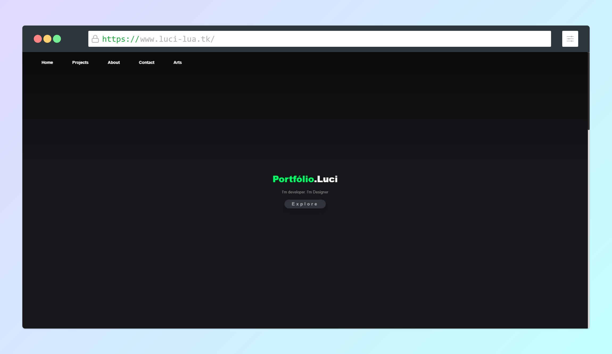

    <h1>🌟 Repositório do meu Portfólio 🌟</h1>
    

        Nele você encontra projetos meus, artes, uma formulário para contato e também um pouco sobre mim. Venho alterando e fazendo ajustes no código ao longo do tempo/ao longo da minha curva de aprendizado.
    

#### 📄 Pages

> <a href="https://www.luci-lua.tk/">Home</a>

> <a href="https://www.luci-lua.tk/projects">Projects</a>

> <a href="https://www.luci-lua.tk/about">About</a>

> <a href="https://www.luci-lua.tk/contact">Contact</a>

> <a href="https://www.luci-lua.tk/arts">Arts</a>

#### 💻 Technologies

    

### 🖼 Preview

